# TutorWiz

TutorWiz provides educational institutions with a simple solution for students requiring additional help. It allows students to ask questions which can then be verified by authorized tutors & teachers. Past questions and answers can be viewed by all students, so all answers help everyone!

## Get Started

Start by going to "https://tutorwiz.onrender.com/"

### Login

Sign up or Login into TutorWiz with Google

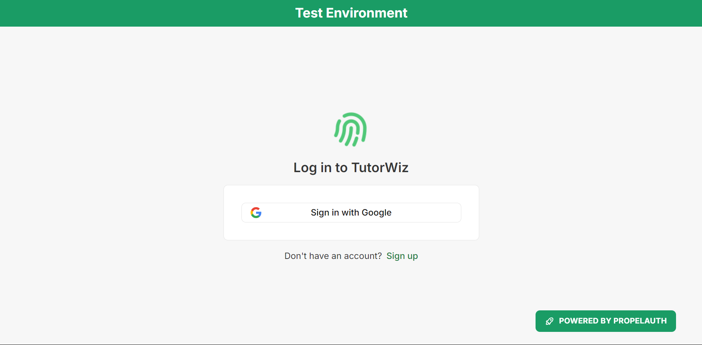

### Profile Page

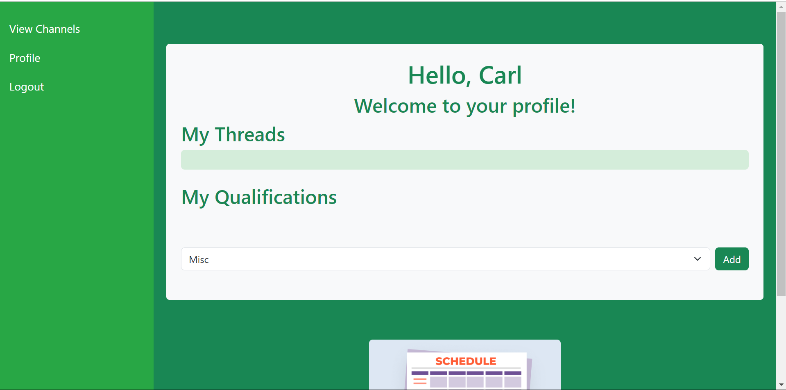

You will begin, after logging in, at the profle page. There you will see your thread history, and qualifications.

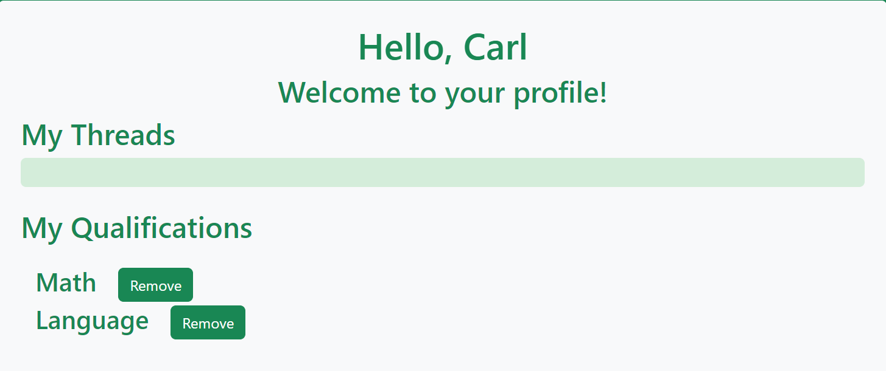

Your qualifications determine which channel you are qualifiied to reply in.

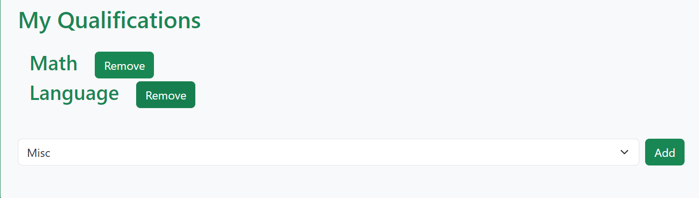

Here is the navigation bar, where you can access your prrofile, a logout page, and a view of the channels: Math, Language, Science, English, History, and Miscellaneous. 

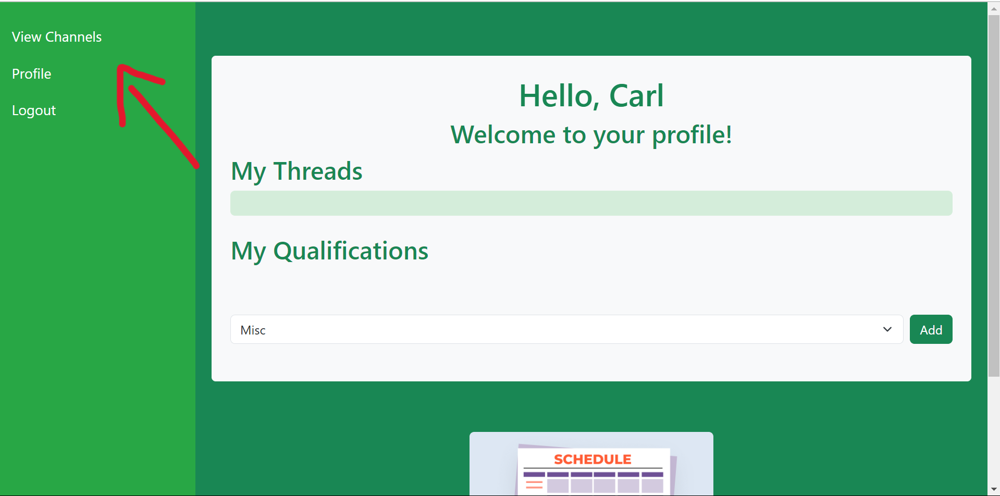

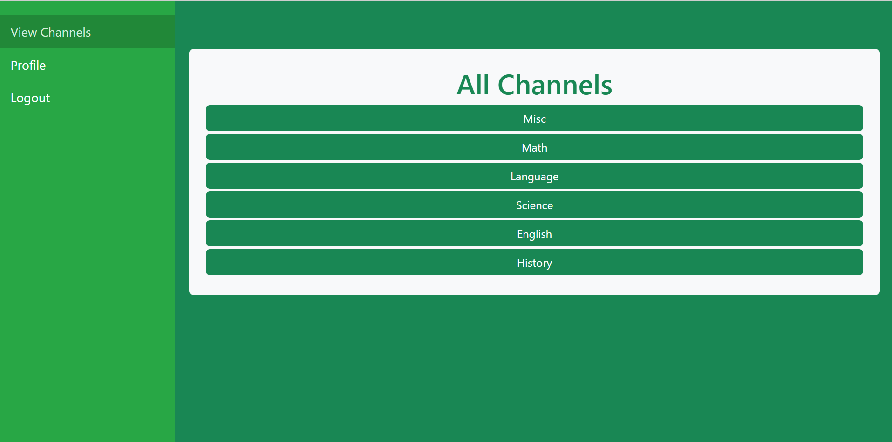

Here you are presented with buttons for 5 subjects, and upon select Math, we can view the threads/questions asked in that channel.

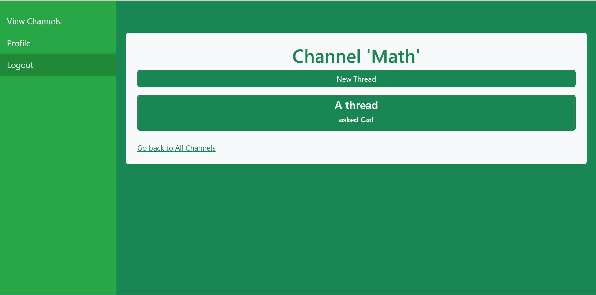

We can then select "New Thread" to ask a new question, which will bring us to the thread creation page. TutorWiz supports rich text like Markdown when creating descriptions for threads. That is how our user was able to create bold text as shown below.

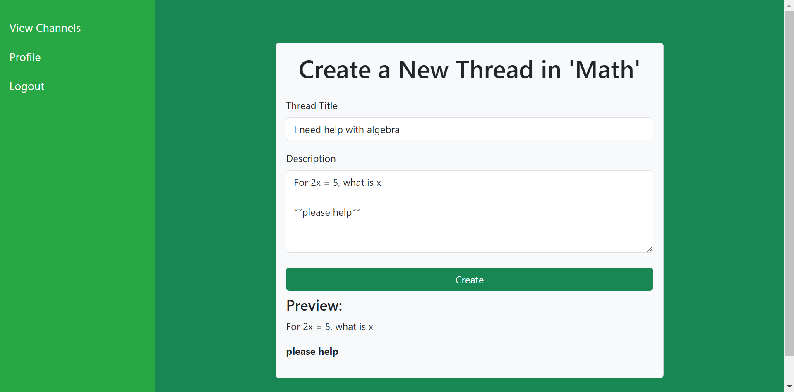

Now, we are in the thread viewing page and we can send chat messages, waiting for a tutor or teacher to provide guidance. The live chat interface also supports Markdown.

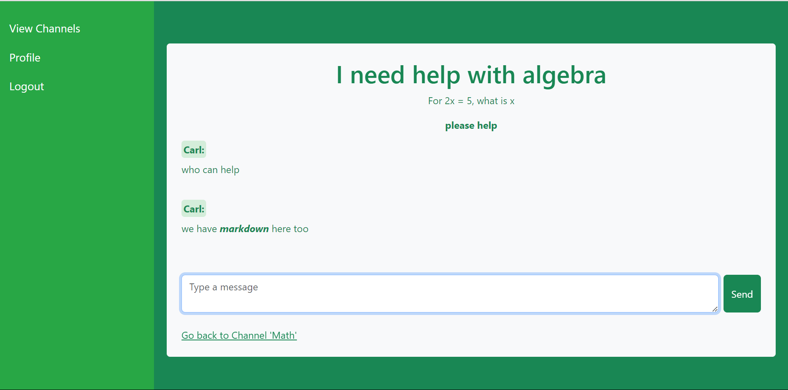

If you have the qualifications to reply in the channel/thread, you may reply to the person's question. Again, Markdown is available in the replies.

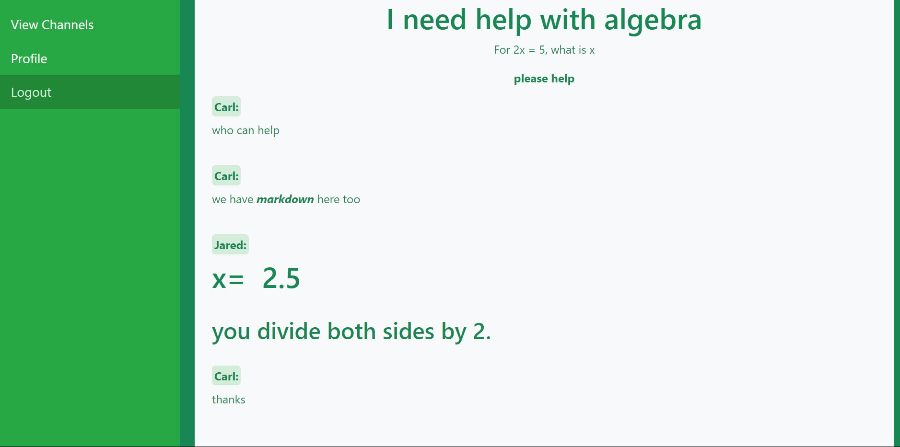

Clicking on someone's username will display their profile, qualifications, and created threads.

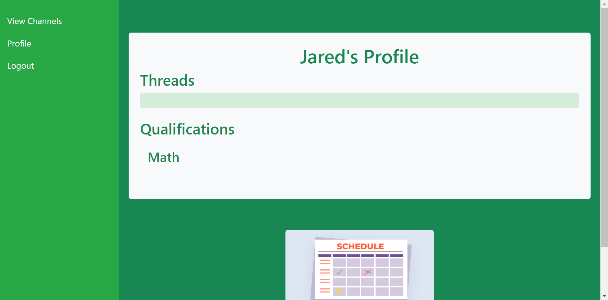